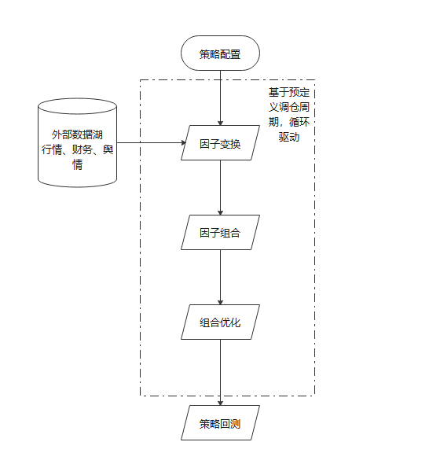

********************
什么是Alpha - Mind？
********************

Alpha - Mind功能
===================

**Alpha - Mind** 是基于多因子分析方法论为基础的，alpha建模的全流程工具。主要包括以下4个大的功能模块：

因子变换
----------------

对于原始数据进行填充、去极端值、中性化、算术计算以及时序和截面操作。帮助用户将原始数据
加工成可以入模的标准因子。

因子组合
----------------

单因子效果有限，真实场景下，我们往往需要将多个因子进行合成。这个合成的过程，可以使用标准的四则运算等方式，
或者基于机器学习的方法。Alpha - Mind同时支持这两种方式。

组合优化
---------------

因子值（alpha）是对股票好坏的预期排序，但是真实投资时候，我们不能完全按照股票本身的alpha大小进行配置，这里面可能涉及
到的因素包括：行业配置的限制、风格暴露的限制、个股的合规限制、跟踪误差限制以及还手率限制。

策略回测
---------------

完成上面所有的步骤之后，我们就完成了数据到股票组合的全流程，随后我们在每个调仓周期上进行调仓，最后得到整个回测周期上的
策略绩效（包括：收益、波动、回撤等）。

流程图
---------------

