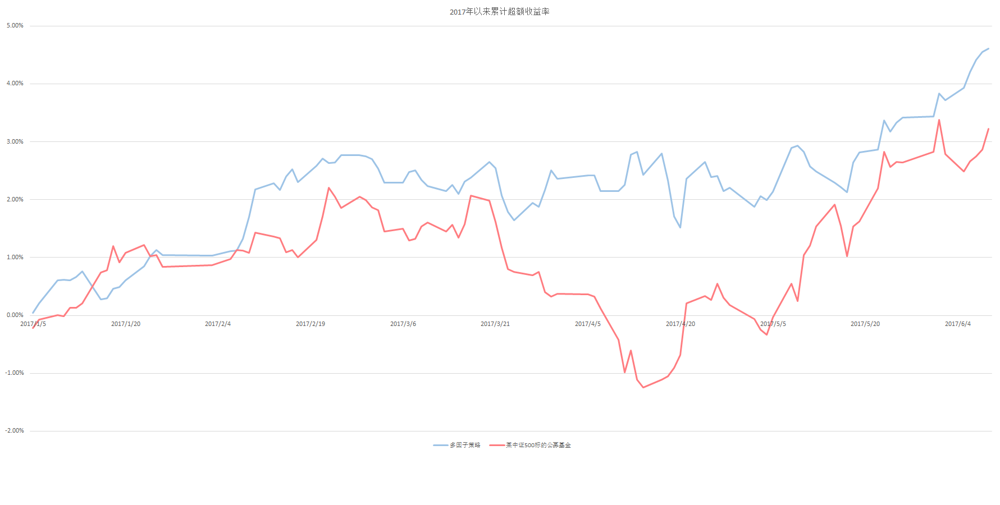

# 策略描述

## 当前策略概述

概述：目前，我们的Alpha策略基于多因子模型框架，以线性模型为基础，以少数近期内表现优秀的基本面或技术面因子作为选股因子，多维度中性化，并经过优化处理后，产生持股权重，以买入持有的方式，以一固定周期进行调整操作；在买入股票的同时，对冲基准所对应的股指期货，以期获得较稳定的超额收益；

表现基准：中证500指数；

选股范围：中证500指数成分股；

选股数量：100只股票左右；

单只股票最大权重：约为1%；

调仓频率：2周；

中性化维度：行业中性化，市值中性化，市场中性化；

策略起始时间：2016年12月；

## 策略改进记录

2017年5月中旬，我们对Alpha策略的进行了较大的升级和变更，为了平稳过渡策略升级以及提升超额收益稳定性，我们将原有的“大股票池子”（约为2000只股票）变更为指数成分股（500只股票）。此次升级的效果比较符合预期，升级后的策略减少了在部分风险因子上的暴露度，降低了超额收益的波动；

这次改动产生的副作用是在5月中下旬的一次调仓中，产生了较高的换手。但是我们估计，这种副作用是一次性的，不会持续，对业绩表现的影响不大。从我们后期跟踪来看，之后的调仓，双边换手都控制在20%左右，不会造成很大的交易难度。

# 业绩回顾

自2016年12月开始策略，截至2017年6月9日，Alpha策略相对于中证500指数的超额收益率约为4.61%，策略的月胜率为71.4%。其中，自2017年5月中旬策略升级以来，实现超额收益约1.97%，

# 未来计划

我们计划在未来进一步目前的多因子模型进行改进，包括但不限于以下列举内容：
- 增加风险因子，改进风险模型，以期更好地控制风险；

  现阶段，风险因子中风格因子偏少，不利于超额收益预测的精细化。未来我们将引入更多的风格因子作为风险刻画的手段。

- 扩展选股范围，争取对于单位风险，实现更大的超额收益；

  5月份升级策略以来，新的择股标准确实起到了降低超额收益波动的作用，这符合我们的预期。同时我们在回测中观察到，如果将新择股方案施加到“大股票池子”中，在并不显著增加波动的情况下，超额收益相对于当前方案更有优势。我们将持续跟踪这一现象，待时机成熟时，将考虑重新回归“大股票池子”轨道。

- 不断开发研究新的因子，更快更准确地捕捉市场信号；

  我们仍然在扩大在库因子的规模，同时做到因子表现的日级监控，月级回顾，力争更加快速准确的捕捉到市场风格的切换。
